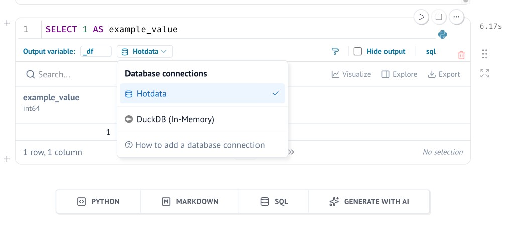

# hotdata-marimo

Marimo widgets for [Hotdata](https://hotdata.dev): run SQL, browse catalogs, load managed databases, and display results in notebooks.

Requires Python 3.10+, [Marimo](https://marimo.io/), and [hotdata-runtime](https://github.com/hotdata-dev/hotdata-runtime) (installed automatically).

## Supported widgets

Importing `hotdata_marimo` registers `mo.ui.hotdata_*` aliases for discoverability.

| Widget | Function | Notes |
|--------|----------|-------|
| SQL editor | `hm.sql_editor(client)` | Returns `.ui` and `.result` |
| Table browser | `hm.table_browser(client)` | Browse connections, schemas, tables, columns |
| Managed databases panel | `hm.databases_panel(client)` | Create catalogs and load parquet files |
| Managed database writer | `hm.managed_database_writer(client)` | Lower-level create/load UI |
| Workspace selector | `hm.workspace_selector_from_env()` | Pick workspace when `HOTDATA_WORKSPACE` is unset |
| Connection picker | `hm.connection_picker(client)` | Dropdown of workspace connections |
| Connection status | `hm.connection_status(client)` | API / workspace health callout |
| Connections panel | `hm.connections_panel(client)` | Status callout plus connection list |
| Query result | `hm.query_result(result)` | Render a `QueryResult` as a table |
| Recent results | `hm.recent_results(client)` | Browse past query results |
| Run history | `hm.run_history(client)` | Recent query runs |

Each widget also has a `mo.ui.hotdata_*` alias (e.g. `mo.ui.hotdata_sql_editor`). Native Marimo SQL cells are supported via `hm.register_hotdata_sql_engine()` and `mo.sql(..., engine=client)`.

## Install

```bash
pip install hotdata-marimo
```

Set `HOTDATA_API_KEY`. Optionally set `HOTDATA_WORKSPACE`, `HOTDATA_API_URL`, or `HOTDATA_SANDBOX`.

## Connect

```python
import hotdata_marimo as hm

client = hm.from_env()
```

If `HOTDATA_WORKSPACE` is unset, pick a workspace interactively:

```python
ws = hm.workspace_selector_from_env()
client = ws.client
```

## SQL editor widget

Run SQL in one cell; show results in the next. Marimo only renders what you **`return`**.

**Cell 1 — editor**

```python
import marimo as mo
import hotdata_marimo as hm

client = hm.from_env()
editor = hm.sql_editor(client, default_sql="SELECT 1 AS ok")
return editor.ui
```

**Cell 2 — result**

```python
return hm.query_result(editor.result)
```

Click **Run on Hotdata** after changing SQL. The editor caches the last successful result so downstream cells do not re-query on every refresh.

## Native Marimo SQL cells

Register the Hotdata engine once, then pass `engine=client` to `mo.sql`. Hotdata appears as **Hotdata** in the SQL connection picker.

**Setup cell**

```python
import marimo as mo
import hotdata_marimo as hm

hm.register_hotdata_sql_engine()
client = hm.from_env()
```

**SQL cell**

```python
_df = mo.sql(
    """
    SELECT 1 AS example_value
    """,
    engine=client,
)
```



## Browse tables

```python
browser = hm.table_browser(client)
return browser.ui
```

Pick a connection, schema, and table to inspect columns. Use `browser.selected_table` in downstream cells.

## Managed databases

Create a Hotdata-owned catalog and load a parquet file from the notebook:

```python
panel = hm.databases_panel(client)
return panel
```

Or use the lower-level writer API:

```python
writer = hm.managed_database_writer(client)
return writer.ui
```

## Other helpers

See [Supported widgets](#supported-widgets) for the full list. Quick examples:

```python
return hm.connection_status(client)
return hm.connections_panel(client)
return hm.recent_results(client).ui
return hm.run_history(client)
```

## Demo notebook

```bash
uv run marimo edit examples/demo.py --no-token
```

`examples/demo.py` combines workspace selection, catalog browsing, managed databases, query history, and a native `mo.sql` cell.

## Development

```bash
uv sync --locked
uv run pytest
```

See [hotdata-runtime](https://github.com/hotdata-dev/hotdata-runtime) for the underlying API client.
